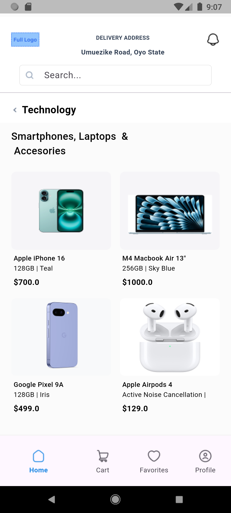
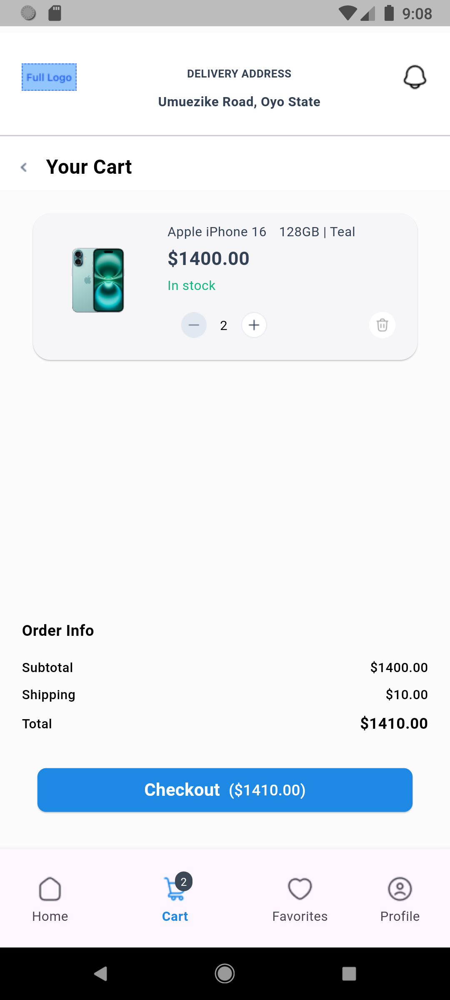
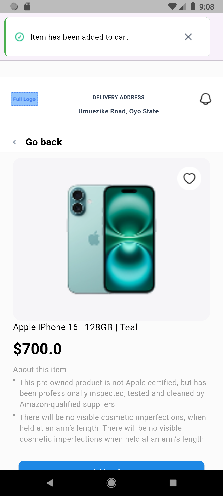
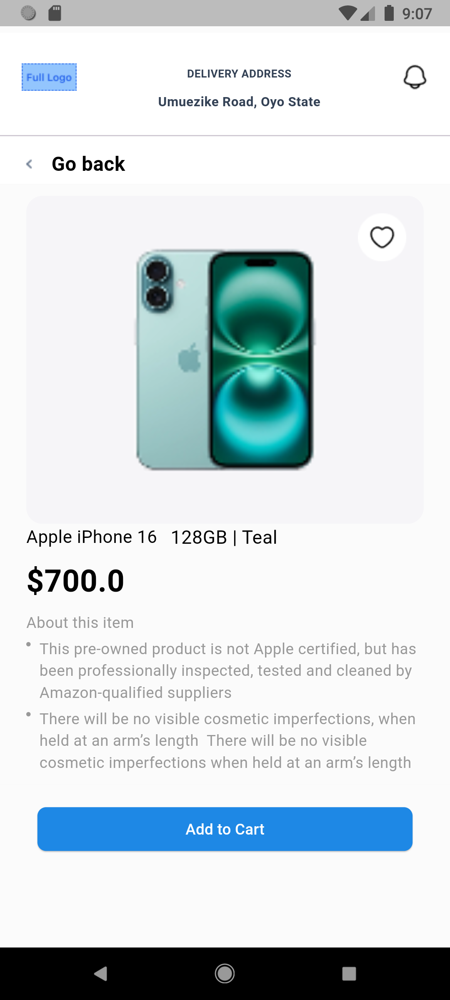

# minimart_app

A new Flutter project — **Minimart Application**.

## 📱 Overview

This is a Minimart application built with Flutter. It serves as a mobile app template for small retail or convenience store management.

## 🛠️ Tech Stack

- **Framework:** [Flutter](https://flutter.dev)
- **Language:** Dart

## 🚀 Getting Started

After cloning the project:

```bash
flutter pub get
flutter run      
```

Make sure Flutter is installed and set up correctly. For more help, check the Flutter documentation.

🖼️ Screenshots
Below are screenshots of the compiled app:

<table> <tr> <td align="center"> <strong>Home Screen</strong><br>  </td> <td align="center"> <strong>Product Details</strong><br>  </td> </tr> <tr> <td align="center"> <strong>Snackbar & Cart</strong><br>  </td> <td align="center"> <strong>Create Page</strong><br>  </td> </tr> </table>